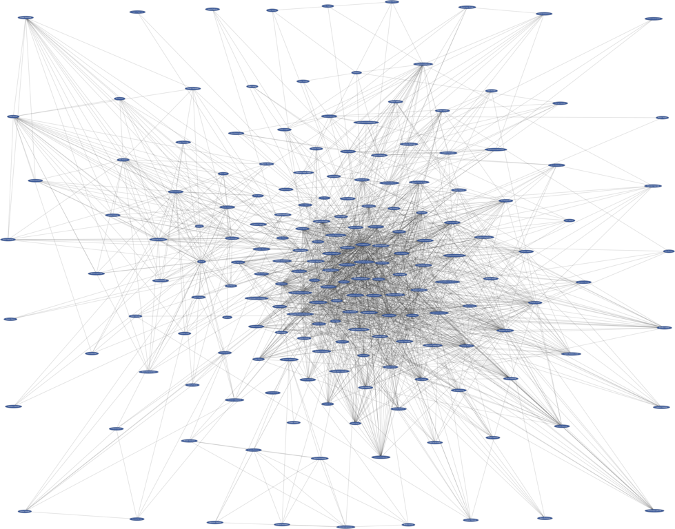

# Friends Graph
Makes graph of facebook user and his friends.

The current implementation uses custom web scraper.
The output graph is written in [DOT Language](http://en.wikipedia.org/wiki/DOT_language)
and could be drawn with [Graphviz](http://en.wikipedia.org/wiki/Graphviz).

**This is for educational purposes only!**

**You should not use it because it violates the [facebook policy](https://www.facebook.com/apps/site_scraping_tos_terms.php)!**

## Example:

